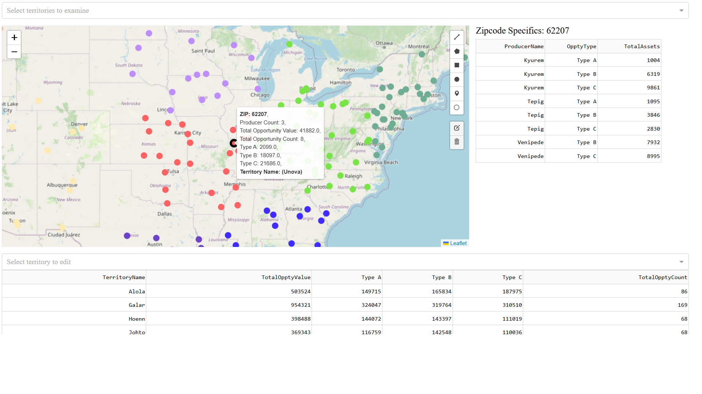

# Sales Territory Reallocation Interactive Dashboard

Populated with real zipcodes and fake producer and territory names (pulled from a Pokemon database).



## How to Use

### File Structure
```
territory-reallocation/
├── assets/
│   ├── dashExtensions_default.js
│   └── sample_data.csv
├── data/
│   ├── pkmndata
│   │   └── Pokemon.csv
│   └── simplemaps
│       └── uszips.csv
├── data_processing_script.R
└── em_app.py
```
You only need the `assets` folder and `em_app.py` to deploy the dashboard. (The `data` folder and `data_processing_script.R` are provided for reproducability in data generation.)

### Directions
Run `em_app.py` and open the localhost link.

Clicking on a point expands the details of the zipcode in table format on the right hand side. Clicking it again deselects the zipcode.

To use, first select at least two territories from the first dropdown menu on top (`Select territories to examine`). The map will update accordingly by only showing points from those territories.
Then, in the second dropdown menu (`Select territory to edit`), select the territory you want to add to. 
On the map, select one of the shape editing tools and draw a polygon on the zipcodes you want to add to the selected territory you are editing. The colors will change to match the selected territory.

To clear everything, either refresh the page, or press the `x` to clear all selected regions in the first dropdown menu at upper right hand corner.
